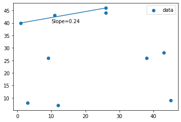
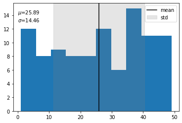

# Chem4301 Computation Introduction
## What this intro will address:

- Python Distributions & Basics
  - miniconda
  - conda package manager
  - useful packages
- Jupyter Notebooks
- Google Colaboratory
- Basic Scripting
  - Data Types
  - Variables
  - Lists and arrays
  - Loops
  - Calculations


## Python Distibutions & Basics
Python is an object oriented programming language used in scientific computing. It's easy use and the large availability of useful libraries are pro's. A con being it is relatively slow. That being said, many big data scientists use python everyday.

###Anaconda & Miniconda
The Anaconda python distribution is an expansive scientific python distribution that comes with the usedful conda  package manager. A condensed and useful version of this distro is the [Miniconda](https://docs.conda.io/en/latest/miniconda.html) distribution. This can easily be installed on all major OS's.

#### Conda
conda is a package manager for Anaconda python. From a command line terminal, one typically only needs to type ``` conda install package_name ``` to install a desired package. Other useful commands include;

```conda list``` - List all installed packages

```conda remove package_name``` - removes package

```conda update package_name```

```conda upgrade package_name```

A full list of commands can be found [here](https://docs.conda.io/projects/conda/en/latest/commands.html). Package installation instructions can also usually be found on that packages documentation website. An example being, if I wanted to install numpy ( anaconda already comes with numpy...but lets suppose), according to their [docs](https://numpy.org/install/) I would install as so;
```
# Text beside hashes are comments
# Best practice, use an environment rather than install in the base env

conda create -n my-env # Create new python environment
conda activate my-env # activate new environment
conda config --env --add channels conda-forge # Add the conda-forge channel to conds
conda install numpy # The actual install command
```
#### Useful packages
For this course, I would assume you would need to use only these 3 packages.

[numpy](https://numpy.org/) - for all your math needs

[matplotlib](https://matplotlib.org/) - Plotting package

[pandas](https://pandas.pydata.org/) - A powerful data analysis package


## Jupyter Notebooks

[Jupyter notebooks](https://jupyter.org/) are interactive, web hosted documents that one can write text, markdown, HTML, LaTeX, and python among many other languages. They are easy to use, have many useful features, and make sharing and displaying what you are working on very simple. It's much better to be able to interactively tweak your code and show images etc. than to have a python script run for a day and a half and have an error.  This document is a jupyter notebook. If you so choose, you're more than welcome to do your work in a jupyter notebooks. If you have a GUI installation of Anaconda you can click on the jupyter widget or if you use a terminal you can type jupyter notebook and copy/paste the browser link into your browser of choice. 

## Google Colaboratory

[Google Colaboratory](https://colab.research.google.com/notebooks/intro.ipynb) is a  drive-like environment for collaboratively working on jupyter notebooks. I will be using this tool for recitations, you may also use it to submit homeworkes and work on challange questions, etc. As far as I can tell (I'm still fairely new to it) it works just like a jupyer notebook, however it should have many major packages preinstalled. To install a package that is not currently installed in a colab notebook, just type a bang (!) in front of it (i.e. ```!pip install package_name```, pip is a python package manager similiar to conda).

## Basic Scripting
### Data Types
  - str: string data type, think words or letters i.e. ```'This is a String'``` and ```['this','is','a','list','of','strings']```

  - int: Integer data are whole numbers. i.e.``` [1,2,3,4,5,6]``` is a list of integers

  - float: float data are decimals, such as ```1.2364534``` or ```1.0```

  - bool: boolean data is either ```True``` or ```False```

### Variables
Setting variables in python is easy.


```
my_var = 'this is my variable'
print(f'my variable, {my_var}is a {type(my_var)}')
```

    my variable, this is my variableis a <class 'str'>


```
# You can also easily overwrite variables
my_var = 64.0
print(f'now my variable, {my_var}is a {type(my_var)}')
```

    now my variable, 64.0is a <class 'float'>


### Lists and Arrays
Lists and arrays can be used to store and manipulate many types of data. Lists can hold different types of data, while arrays store homogenous types of data. Lists are native in python while arrays must be imported, typically via numpy.


```
my_list = [] # Empty
my_list.append('my_string') # adding to list
my_list.append(1)
my_list.append(2.0)
my_list.append(True)
print(f'My multi datatype list, {my_list}')
```

    My multi datatype lisr, ['my_string', 1, 2.0, True]


```
import numpy as np
my_array = np.array((1,2,3,4,5,6))
my_array_2 = np.array(('these','are','strings'),dtype=str)
print(f'{my_array}: datatype{my_array.dtype}, {my_array_2}: datatype{my_array_2.dtype}')
my_array_3 = np.array(('cannot','print','this',1.0))
print(f'my_array_3: datatype{my_array_3.dtype}') # The last entry is a float not a str
```

    [1 2 3 4 5 6]: datatypeint64, ['these' 'are' 'strings']: datatype<U7
    my_array_3: datatype<U6


```
# Python lists and arrays are 0-indexed meaning that the first entry in each list/array can be called by a statement
# such as list[0]
print(my_list[0])
```

    my_string


```
# We can also call on the final element of a list through negative indexing
print(f'{my_list[-1]} = {my_list[3]} ')
```

    True = True 


```
# Each list and array will have a length and each array will have a shape as well
# The shape of an array is important in matrix operations
print(len(my_list))
print(len(my_array))
print(my_array.shape)
```

    4
    6
    (6,)


```
new_array=np.ones((3,2))
print(f'{new_array} : shape is {new_array.shape} (dimension, elements in dimension')
```

    [[1. 1.]
     [1. 1.]
     [1. 1.]] : shape is (3, 2)


```
# We can slice our arrays row or columnwise as so
transform = new_array * np.array((3,8))
print(transform)
print(transform[:,0]) # Select first element in each dimension
print(transform[0,:]) # select each element in first dimension
```

    [[3. 8.]
     [3. 8.]
     [3. 8.]]
    [3. 3. 3.]
    [3. 8.]


### Loops
for loops, it is very important that the commands be below the statement (enter) and either 4 spaces or a tab from the statement beginning.
#### If statement
Syntax
```
if condition:
  command
elif other condition: # Else if
  different command
else:
  yet another different command
```
For an if statement, if the condition is satisfied do the first command, else if, do the second, else all other conditions, do the third


```
if type(my_list[0]) is str:
  print('It\'s a string')
else:
  print('not a string')

if type(my_list[0]) is int:
  print('It\'s a int')
elif type(my_list[0]) is float:
  print('it\'s a float')
else:
  print('neither int nor float')
```

    It's a string
    neither int nor float


#### While loop
Syntax
```
while condition:
  command
```
While the condition is satisfied, do the command


```
number = 0
while number < 7:
  print(f'{number} is less than 7')
  number += 1    # += adds 1 to number and redefines number as number+1
```

    0 is less than 7
    1 is less than 7
    2 is less than 7
    3 is less than 7
    4 is less than 7
    5 is less than 7
    6 is less than 7


#### For loop
Syntax
```
for value in sequence
    command
```
for a value in a sequence, do some command, this is a little more abstract, but (imo) the most widely used loop in calculations.


```
for element in my_list:
  print(element, type(element))
```

    my_string <class 'str'>
    1 <class 'int'>
    2.0 <class 'float'>
    True <class 'bool'>


for loops are also useful for manipulating lists/arrays index-wise


```
for index,element in enumerate(my_list):
  print(index,element)
```

    0 my_string
    1 1
    2 2.0
    3 True


Putting this all together we can create loops within loops


```
for index,element in enumerate(my_list):
  if type(element) is str:
    print(f'{index} {element}:string')
  elif type(element) is int:
    print(f'{index} {element}:int')
  else:
    print(f'{index} {element} Ok this is getting old')
```

    0 my_string:string
    1 1:int
    2 2.0 Ok this is getting old
    3 True Ok this is getting old


#### Putting it all together: List Comprehension!
While loops are useful and essential when beginning to learn python, sometimes we can cut corners ( and speed up out code) by using list comprehension. Lets say that we wanted to randomly generate some x and y data, and compile them into defined points.
 


```
x = np.random.randint(50,size=10)
y = np.random.randint(50,size=10)
print(x)
print(y)
```

    [26 43 45 38 12  3  1  9 26 11]
    [46 28  9 26  7  8 40 26 44 43]


```
points = np.array([(i,y[j]) for j,i in enumerate(x)])
print(points)
```

    [[26 46]
     [43 28]
     [45  9]
     [38 26]
     [12  7]
     [ 3  8]
     [ 1 40]
     [ 9 26]
     [26 44]
     [11 43]]


### Calculations
```
Operations native to python:
+ : addition
- : subtraction
* : multiplication
/ : division
**(value) : exponent
E(value) : 10^(value)
% : modulo ( returns remainder of division
Numpy operations and values:
np.exp(value) : exp(value)
np.log(value) : nat. log
np.log10(value) : log base 10
np.dot(x,y) : dot product
np.mean(list) : average
np.std(list) : standard deviation
np.sqrt(value) : square root
```


```
# Lets do a test calculations on x, y, and points
# for this example, we will also define a generalized function to find the slope

def find_slope(array,index1,index2):
  x1 = array[index1][0]
  print(f'x1 is {x1}')
  x2 = array[index2][0]
  print(f'x2 is {x2}')
  y1 = array[index1][1]
  print(f'y1 is {y1}')
  y2 = array[index2][1]
  print(f'y2 is {y2}')
  m = (y2-y1)/(x2-x1)
  print(f'Slope between point {index1 +1} and point {index2 + 1} is {m}')
  return m 
# Let's test it out
find_slope(points,0,6)
```

    x1 is 26
    x2 is 1
    y1 is 46
    y2 is 40
    Slope between point 1 and point 7 is 0.24


    0.24


### A little on Packages and Plotting


```
 # To use packages we must import them to the notebook, numpy is already imported
 from matplotlib import pyplot as plt

 # Lets plot our points
 fig, ax = plt.subplots()
 ax.scatter(points[:,0],points[:,1],label='data') # scatter plot of our points
 ax.legend() # let's put a legend in this
 # Lets draw a line between point 1 and 7
 ax.plot((points[0][0],points[6][0]),(points[0][1],points[6][1]))
 # Let's denote the slope of the line we calculated previously
 ax.annotate(f'Slope={find_slope(points,0,6)}',xy=(10,40))
```

    x1 is 26
    x2 is 1
    y1 is 46
    y2 is 40
    Slope between point 1 and point 7 is 0.24


    Text(10, 40, 'Slope=0.24')





```
# Now lets try a histogram of a random distribution
data = np.random.randint(50,size=100)
```


```
fig,ax = plt.subplots()
ax.hist(data,bins=10)
# Now we'll find the mean
mean = np.around(np.mean(data),2)
std = np.around(np.std(data),2)
ax.annotate(f'$\mu$={mean} \n$\sigma$={std}',xy=(0,13))
#And put a line @ the mean
ax.axvline(mean,c='black',label='mean')
ax.axvspan(mean-std, mean+std, alpha=0.2, color='grey',label='std')
ax.legend()

```


    <matplotlib.legend.Legend at 0x7fda86c9b1d0>





### This is just a really quick introduction to these concepts and programs. Google and tutorials are truly your best friend with scientific programming.
